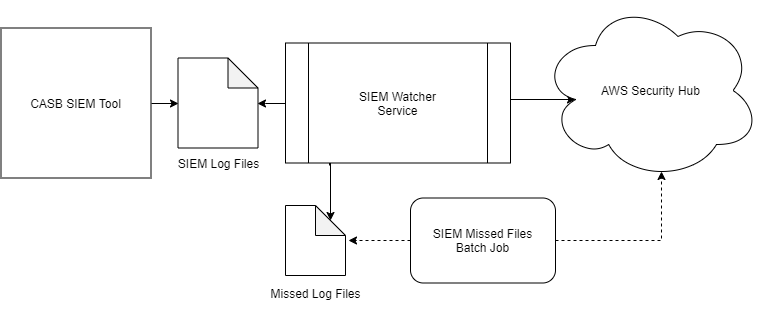

# Technical Overview

This was developed in order to capture Forcepoint CASB SIEM logs, map them and upload them into AWS Security Hub

It consists of one service (SIEM Watcher) and two jobs (SIEM Missed Files Batch and SIEM tool).

<p align="center">
    
</p>

## SIEM Watcher Service

This service does multiple things:

- Watch the SIEM directory in real time to capture log files
- Map the logs into AWS Security Hub ASFF formate.
- Sends events into AWS Security Hub.
- It saves the events into a file for later processing in case of no AWS connenction.
- In case this service is killed, once it's triggered again, it will pick up from were it left off and it will send all the missed previous events.

## SIEM Missed Files Batch Job

This job will pick any events were missed due to Network down or AWS failed connection and upload them.

## SIEM Tool

This tool is provided by forcepoint CASB.

```bash
./SIEMClient.sh --credentials.file <path/casb-credentials-store> --host my.skyfence.com --port 443 --output.dir <path/casb-activity-files> truststorePath=<trus-store-path> cefVersion=3
```

## Implementation

In this process logs are configured to rotated by size of 20mb into max of 5 rotated files.

Prerequisites are: python3.8 pipenv openjdk8

Code tests can be run by

```bash
pipenv run pytest
```

## User Configurations cfg.json

- firstRunSendHistoricalData: if it is set to true, it will process all the historical SIEM files in case of SIEM existence before this integration
- deleteSiemFiles: if it is set to true, it will will delete the SIEM files from their origin directory after processing the file (Recomended if SIEM tool is not used for any other process for storage clean up)
- severityFilterInclude: remove any values in ["Info", "Low", "Medium", "High", "Critical"] if not required to send to AWS Security Hub e.g. ["High", "Critical"]
- actionFilterInclude: remove any values in ["Block", "Monitor"] if not required to send to AWS Security Hub e.g. ["Block"]
- productFilterInclude: remove any values in ["SaaS Security Gateway", "CASB Incidents", "CASB Admin audit log", "Cloud Service Monitoring"] if not required to send to AWS Security Hub
- govFlag: government or commercial integration, set to false by default for commercial
- AWS Configurations:
  - awsAccountId
  - awsAccessKeyId
  - awsSecretAccessKey
  - regionName: e.g. "eu-west-2"

```json
{
    "siemPath": "<casb-siem-activity-files-path>",
    "firstRunSendHistoricalData": true,
    "deleteSiemFiles": true,
    "severityFilterInclude": ["Info", "Low", "Medium", "High", "Critical"],
    "actionFilterInclude": ["Block", "Monitor"],
    "productFilterInclude": [
        "SaaS Security Gateway",
        "CASB Incidents",
        "CASB Admin audit log",
        "Cloud Service Monitoring"
    ],
    "govFlag": false,
    "awsAccountId": "",
    "awsAccessKeyId": "",
    "awsSecretAccessKey": "",
    "regionName": ""
}
```

## Docker

Package deployment first, then run image build.

```bash
./build/create-deployment.sh && \
docker build -t fp-casb-exporter-aws .
```

Edit cfg.env file first and then create container:
Note: this depends on fp-casb-siem-importer container running

```bash
docker run -itd \
   --name fp-casb-exporter-aws \
   --env-file $PWD/cfg.env \
   --volume FpCasbLogsVolume:/forcepoint-logs \
   fp-casb-exporter-aws
```

Another way to run a container without cfg.env, create cfg.json and run below:
Note: this depends on fp-casb-siem-importer container running

```bash
docker run -itd \
   --name fp-casb-exporter-aws \
   --volume $PWD/cfg.json:/usr/fp-casb-exporter-aws/cfg.json \
   --volume FpCasbLogsVolume:/forcepoint-logs \
   fp-casb-exporter-aws
```
